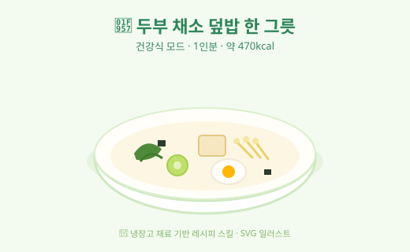

# 🥗 두부 채소 덮밥 한 그릇

> 건강식 모드 · 1인분 · 🎲 랜덤 추첨 선택
> 저염·저당 · 단백질 + 채소 균형 한 끼

**🔢 한 끼 총 예상 칼로리: 약 470kcal** (메인 380 + 사이드 90 · 가정 기반 추정)

## 사용한 냉장고 재료
| 재료 | 분량 | 영양군 |
|------|------|--------|
| 밥 | 1공기 | 탄수화물 |
| 두부 | 1/2모 | 단백질 |
| 계란 | 1개 | 단백질 |
| 시금치 | 1/2단 | 채소 |
| 콩나물 | 1줌 | 채소 |
| 애호박 | 1/2개 | 채소 |
| 양파 | 1/4개 | 채소 |
| 다진마늘 | 1/2큰술 | 향 |
| 구운김 | 1장 | 고명 |

## 🍛 메인 — 두부 채소 덮밥 (약 380kcal)
1. **두부 1/2모**를 깍둑 썰어 키친타월로 물기를 빼고, 기름 없이 마른 팬에 노릇하게 구워 단백질 토핑을 만든다.
2. 같은 팬에 물 1큰술을 두르고 **애호박 1/2개·양파 1/4개**를 채 썰어 **다진마늘 1/2큰술**과 함께 볶듯 데친다. (기름 최소화)
3. **시금치 1/2단**은 끓는 물에 30초만 데쳐 찬물에 헹구고 물기를 짠 뒤 소금 약간으로만 가볍게 무친다.
4. 그릇에 **밥 1공기**를 담고, 구운 두부 + 채소들을 색 맞춰 둘러 담는다.
5. **계란 1개**를 반숙 프라이로 올리고, **구운김 1장**을 부숴 뿌린다. 간장은 살짝만.

## 🥢 사이드 — 콩나물 맑은국 (약 90kcal)
1. 냄비에 물 2컵과 **콩나물 1줌**을 넣고 뚜껑을 덮어 5분간 끓인다. (비린내 방지 위해 끓는 동안 뚜껑 열지 않기)
2. **다진마늘 약간**과 소금으로 슴슴하게 간하고, 남은 대파를 송송 썰어 마무리.

## 영양 코멘트
- **단백질**(두부·계란) + **채소**(시금치·콩나물·애호박·양파)가 한 그릇에 모두 들어가 균형이 좋다.
- 기름을 거의 쓰지 않고 데치기·굽기 위주라 **저칼로리·저염**. 간장/소금은 마지막에 최소로.
- 더 든든하게: 멸치를 살짝 볶아 올리면 칼슘 + 단백질 보강 (+약 30kcal).

---
*🍳 냉장고 재료 기반 레시피 스킬 — 건강식 모드(🎲 랜덤 선택)로 생성됨*
