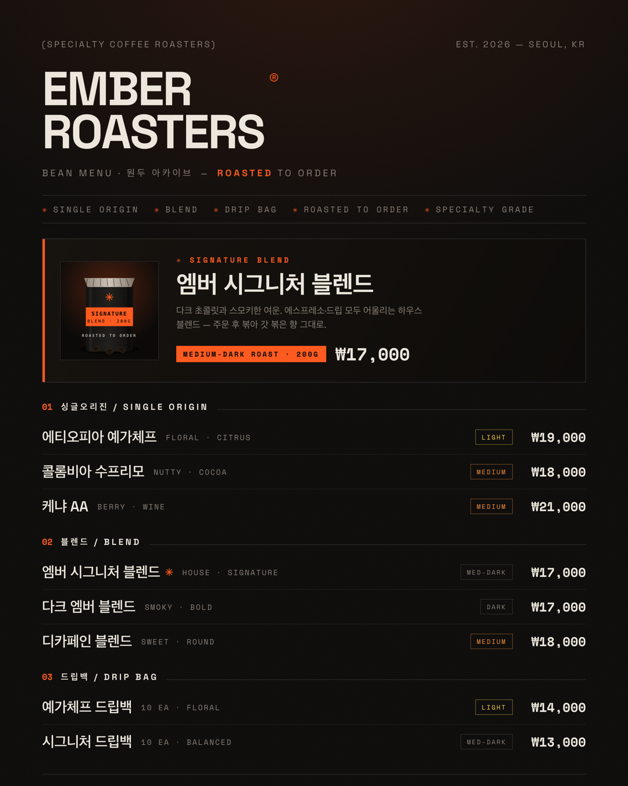

# 📜 Q2. [Design] 카페 메뉴판 만들기 — 25pt

> 🎯 손님이 처음 봤을 때 "여기 들어가고 싶다" 싶은 메뉴판 한 장

## 결과물


`메뉴판_EmberRoasters_1080x1350.png` · **1080×1350** (인스타 4:5) · `sips` 실측 통과

---

## 1. 왜 "Ember Roasters"인가 — 내가 만든 앱의 디자인을 그대로 계승

컨셉을 새로 지어내지 않았다. **6주차에 직접 만든 커피 쇼핑몰 앱**의 디자인 시스템을 메뉴판에 그대로 옮겼다.
(`ai_6week_study/[Auth + DB] 커피 쇼핑몰 (스페셜티 로스터리)/index.html` — ☕ **Ember Roasters®**)

| 메뉴판 요소 | 원본 앱(`index.html`)에서 그대로 추출 |
|---|---|
| 브랜드 **EMBER ROASTERS®** | `<title>Ember Roasters® — Specialty Coffee / Experiment Space` · `<h1>EMBER ROASTERS` |
| 컬러 ink `#0b0a09` · paper `#ece6dc` · **ember `#ff5a1f`** · muted `#8b8178` | `tailwind.config` `:root` 색 토큰 원문 |
| 폰트 **Space Grotesk + Space Mono** | `sans:['Space Grotesk'...]` · `mono:['Space Mono'...]` |
| 필름 그레인 + 앰버 글로우 | `.grain` feTurbulence SVG · `radial-gradient(...rgba(255,90,31,.10))` 원문 |
| 헤드라인 "ROASTED TO ORDER" | 히어로 `<h2>ROASTED<br><span>TO ORDER.` |
| 마퀴 `✳ SINGLE ORIGIN · BLEND · DRIP BAG …` | `Marquee` items 배열 원문 |
| 카테고리 **싱글오리진 / 블렌드 / 드립백** | `CATEGORY_OPTIONS = ['싱글오리진','블렌드','드립백']` |
| 로스트 **라이트/미디엄/다크** + 색 | `ROAST_OPTIONS` · `ROAST_TONE`(라이트=amber / 미디엄=orange / 다크=muted) |
| ₩ 통화 · 무료배송 ₩30,000+ | `won()` 포맷 · `FREE SHIPPING ₩30,000+` 마퀴 |

> 즉, 이 메뉴판은 **실제로 배포하려던 내 쇼핑몰의 오프라인 버전**이다. 앱 ↔ 인쇄물의 톤을 하나로 묶었다.

## 2. 컨셉 한 단락 (제출물)

> **Ember Roasters®** 는 "주문 후 볶는(Roasted to Order)" 서울의 스페셜티 원두 로스터리다.
> 웜블랙 배경에 잉걸불 같은 앰버 오렌지, Space Grotesk의 굵은 타이포와 Space Mono 라벨 —
> Obys "Experiment Space" 톤으로 실험적이면서 진지한 무드를 잡았다. 메뉴판은 카페 벽면/QR 랜딩에
> 그대로 걸 수 있는 **원두 아카이브(Bean Menu)** 형태다.

- **분위기**: 웜블랙 × 앰버 · 그레인 · 헤어라인 그리드 (실험적 · 미니멀)
- **타겟**: 갓 볶은 스페셜티 원두를 찾는 홈카페·오피스 손님

## 3. 미션 요구 충족 체크

| 파트 | 요구 | 충족 |
|---|---|---|
| Part 1 — 컨셉 | 이름·분위기·타겟 | ✅ §2 |
| Part 1 — 컬러 | **3색 이내** | ✅ ink(웜블랙) + paper(크림) + **ember(앰버)** = 3색 · muted는 크림의 저채도 뉴트럴 |
| Part 1 — 폰트 | **2개 이내** | ✅ **Space Grotesk**(제목·상품명) + **Space Mono**(라벨·가격) · 한글은 시스템 폴백(Apple SD Gothic) |
| Part 2 — 카테고리 | **3개 이상** | ✅ 싱글오리진 / 블렌드 / 드립백 = 3개 |
| Part 2 — 메뉴 | **8개 이상** | ✅ **8개** (+시그니처 배너) |
| Part 2 — 시그니처 | **1개** | ✅ 엠버 시그니처 블렌드 (✳ + 상단 전용 배너) |
| Part 3 — 사이즈 | **1080×1350** or A4 | ✅ 1080×1350 |
| Part 3 — 시그니처 강조 | 이미지 + 강조색 | ✅ 원두백 비주얼 + 앰버 좌측 바 + 앰버 라벨 |
| Part 3 — 위계 | 카테고리 위계 | ✅ `01/02/03` 넘버 + 헤어라인 + 로스트 태그 + 우측정렬 가격 |
| Part 4 — 공유 | 단톡방/인스타 | ⏳ PNG 준비 완료 (게시는 사용자 계정) |

## 4. 메뉴 근거 — 앱의 분류·로스트는 원문, 개별 원두는 설계값

카테고리(싱글오리진/블렌드/드립백)·로스트(라이트/미디엄/다크)·통화·무료배송 기준은 **앱 코드 원문**이다.
개별 원두명·가격(에티오피아 예가체프 ₩19,000 등)은 앱에 시드 데이터가 없어, **스페셜티 상식 범위**로
책정한 설계값이다(실판매가 아님). 원산지 특성 태그(Floral·Nutty·Berry 등)도 통상적 컵노트다.

## 5. 비주얼 — 원두백 SVG (수작업)

생성형 이미지 무료 티어가 유료화(402)돼, 시그니처 원두백을 **직접 SVG로 그렸다**
(`생성이미지/ember_원두백.svg`). 매트 블랙 봉투 + 앰버 라벨(SIGNATURE BLEND · 200G) + `ROASTED TO ORDER`
스탬프 + 원두 알갱이. Ember의 미니멀 톤에 맞춰 벡터로 조립.

## 6. 제작·렌더 방식

- **조판**: HTML/CSS (`menu.html`) — 앱의 그레인/글로우/마퀴/헤어라인을 CSS로 재현
- **렌더**: 헤드리스 Chrome 2x(2160×2700) → 1080×1350 다운스케일
- **폰트**: Space Grotesk + Space Mono (구글) · 한글 Apple SD Gothic Neo 폴백

> 🔧 **수정 기록**: 1차 시안은 하버스카페(밝은 크림) 톤이었으나, **"내가 만든 커피 쇼핑몰(Ember Roasters) 디자인 기준으로"** 재작업 요청에 따라 앱의 웜블랙×앰버 시스템으로 전면 교체했다. 마퀴 끝 항목이 우측에서 잘려 어색해 마지막 태그를 빼고 깔끔하게 끝나도록 정리했다.

## 7. 규격 검증

| 체크 | 결과 |
|---|---|
| 1080×1350 | ✅ `sips` 실측 |
| 컬러 3색 이내 | ✅ 웜블랙·크림·앰버 |
| 폰트 2개 이내 | ✅ Space Grotesk + Space Mono |
| 카테고리 3+ / 메뉴 8+ / 시그니처 1 | ✅ 3 / 8 / 1 |
| 모바일 축소 가독성 | ✅ `검증_모바일미리보기/메뉴판_350.png` |

## 8. 파일 구조
```
[Q2] 카페 메뉴판 만들기/
├── README.md
├── menu.html                             ← Ember Roasters 디자인 재현 조판
├── 메뉴판_EmberRoasters_1080x1350.png      ← 최종 제출물
├── 생성이미지/ember_원두백.svg              ← 수작업 시그니처 비주얼
└── 검증_모바일미리보기/메뉴판_350.png        ← 축소 가독성 검증
```
