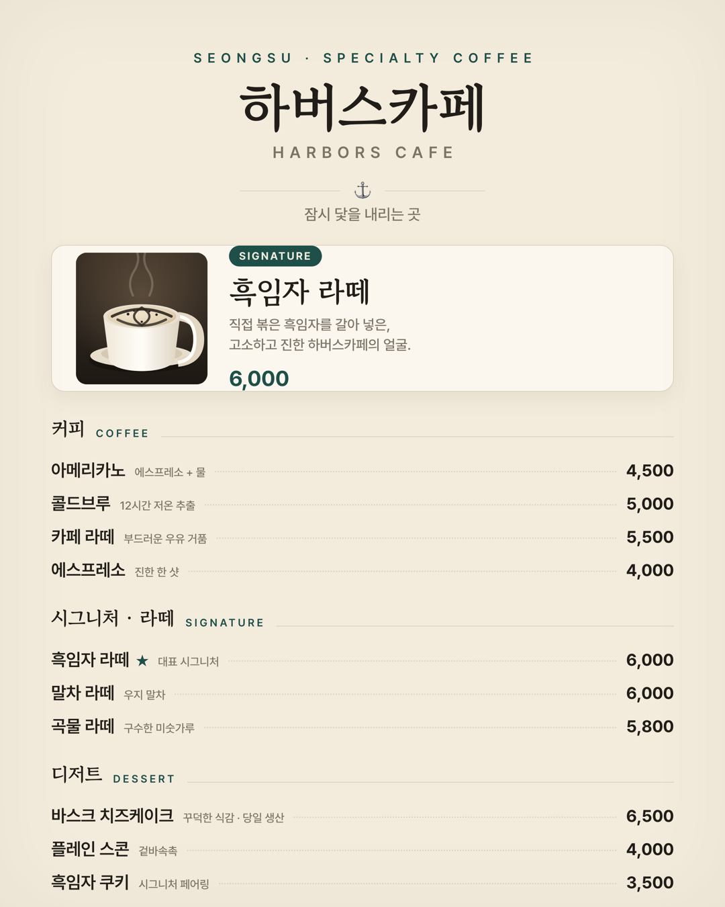

# 📜 Q2. [Design] 카페 메뉴판 만들기 — 25pt

> 🎯 손님이 처음 봤을 때 "여기 들어가고 싶다" 싶은 카페 메뉴판 한 장

## 결과물


`메뉴판_하버스카페_1080x1350.png` · **1080×1350** (인스타 4:5) · `sips` 실측 통과

---

## 1. 왜 새로 짜지 않고 "하버스카페"인가 — 근거

컨셉을 즉석에서 지어내지 않았다. **6주차에 직접 작성한 카페 컨텍스트**를 그대로 인풋으로 썼다.
(`ai_6week_quest/[Context+Agent+DB] 내 카페를 아는 AI 에이전트/my_cafe.md`)

| 메뉴판에 쓴 것 | 출처 (`my_cafe.md`) |
|---|---|
| 카페명 **하버스카페 / Harbors Cafe** | `# 내 카페: 하버스카페 (Harbors Cafe)` |
| 슬로건 "잠시 닻을 내리는 곳" | `슬로건: "잠시 닻을 내리는 곳, 하버스카페"` |
| 위치 "서울 성수동 골목 안쪽" | `서울 성수동 … 메인 대로보다 한 블록 안쪽 골목` |
| 시그니처 **흑임자 라떼 6,000** | `시그니처 메뉴: 흑임자 라떼 … 6,000` |
| 바스크 치즈케이크 6,500 / 당일 생산 | `바스크 치즈케이크 6,500` · `디저트는 당일 생산 한정` |
| 아메리카노 4,500 / 콜드브루 5,000 / 스콘 4,000 | `가격대` 항목 그대로 |
| 연락 @harbors.cafe / 02-1234-5678 | `채널: 인스타 @harbors.cafe / 전화 02-1234-5678` |

## 2. 컨셉 한 단락 (제출물)

> **하버스카페**는 성수동 카페거리 메인 대로에서 한 블록 안쪽, 조용한 골목에 자리한 스페셜티 카페다.
> 옆집이 "사진 맛집"이라면 우리는 **직접 볶은 흑임자를 갈아 넣은 시그니처 흑임자 라떼**와, 콘센트·1인 바석을 갖춘
> "오래 머물기 좋은 작업 카페"로 승부한다. 슬로건은 "잠시 닻을 내리는 곳". 원목과 스틸, 차분한 간접조명의 무드를
> 메뉴판에도 그대로 옮겼다.

- **분위기**: 원목 + 스틸 · 차분함 (미니멀 × 코지)
- **타겟**: 성수동 20~30대 직장인·디자이너·프리랜서, 오래 머무는 작업 손님

## 3. 미션 요구 충족 체크

| 파트 | 요구 | 충족 |
|---|---|---|
| Part 1 — 컨셉 | 이름·분위기·타겟 한 줄씩 | ✅ §2 |
| Part 1 — 컬러 | **3색 이내** | ✅ 크림 `#F3ECDD` + 잉크 `#211D18` + **하버 틸 `#1E4F49`** (메인 1 + 보조 2) |
| Part 1 — 폰트 | **2개 이내** | ✅ **Gowun Batang**(제목·시그니처) + **Pretendard**(본문·가격) |
| Part 2 — 카테고리 | **3개 이상** | ✅ 커피 / 시그니처·라떼 / 디저트 = 3개 |
| Part 2 — 메뉴 | **8개 이상** | ✅ **10개** |
| Part 2 — 시그니처 | **1개 선정** | ✅ 흑임자 라떼 (★ + 전용 카드로 강조) |
| Part 3 — 사이즈 | A4 세로 or **1080×1350** | ✅ 1080×1350 |
| Part 3 — 시그니처 강조 | 사진·일러스트 + 강조색 | ✅ 상단 전용 카드 + 흑임자 라떼 일러스트 + 틸 강조 |
| Part 3 — 위계 | 카테고리 위계 한눈에 | ✅ 세리프 카테고리 헤더 + 도트 리더 + 우측정렬 가격 |
| Part 4 — 공유 | 단톡방/인스타 공유 | ⏳ 이미지 PNG 준비 완료 (게시는 사용자 계정) |

> 💡 팁 반영: **가격 우측정렬**(가독성), **시그니처 1개에만 시각적 무게**(상단 카드), **폰트 2개·컬러 3색 제한** 전부 지킴.

## 4. 메뉴 근거 — 지어낸 가격은 표기

`my_cafe.md`에 명시된 5개 메뉴는 **가격까지 원문 그대로** 옮겼고, 8개 요건을 채우려 추가한 5개는
브랜드 톤(흑임자·한국적 라떼)에 맞춰 **동네 평균 근방으로 합리적으로 책정**했다. 실제 판매 데이터가 아니라
메뉴 구성을 위한 설계값이다.

| 메뉴 | 근거 |
|---|---|
| 아메리카노 4,500 · 콜드브루 5,000 · 흑임자 라떼 6,000 · 바스크 치즈케이크 6,500 · 스콘 4,000 | **`my_cafe.md` 원문** |
| 카페 라떼 5,500 · 에스프레소 4,000 · 말차 라떼 6,000 · 곡물 라떼 5,800 · 흑임자 쿠키 3,500 | 브랜드 톤 맞춤 **설계값** (실측 아님) |

## 5. 비주얼 — 왜 사진이 아니라 SVG 일러스트인가

당초 생성형 이미지(Pollinations `flux`, G1·G2에서 쓰던 무료 경로)로 시그니처 사진을 만들려 했으나,
**2026-07-19 기준 무료 티어가 유료화**되어 전 모델이 `402 PAYMENT_REQUIRED`로 실패했다.
(`flux`/`turbo`/`flux-schnell` 모두 확인)

→ 외부 생성 실패를 감추지 않고, **직접 손으로 그린 SVG 일러스트**(`생성이미지/drink_흑임자라떼.svg`)로 대체했다.
컵·흑임자 라떼 아트(스월)·스팀·받침을 벡터로 조립. 미니멀 스페셜티 카페 톤에는 오히려 일러스트가 맞고,
무엇보다 **재현 가능하고 폰트·색이 브랜드와 정확히 일치**한다.

## 6. 제작·렌더 방식

- **조판**: HTML/CSS (`menu.html`) — 시맨틱 구조, 도트 리더는 CSS `border-bottom:dotted`
- **비주얼**: 수작업 SVG (`생성이미지/drink_흑임자라떼.svg`)
- **렌더**: 헤드리스 Chrome `--headless=new --force-device-scale-factor=2 --window-size=1080,1350` → 2160×2700 캡처 후 1080×1350로 다운스케일 (선명도 확보)
- **폰트**: Gowun Batang(구글) + Pretendard(CDN)

> 🔧 **수정 기록**: 1차 렌더에서 시그니처 카드가 깨졌다 — 세로 비율 SVG(340×760)를 짧은 카드에 `object-fit:cover`로 넣으니 컵만 확대돼 텍스트를 덮고 설명·가격이 잘렸다. **정사각(240×240) 썸네일 SVG로 다시 그리고 카드 높이를 252px로 고정**하니 해결. 이미지 비율과 컨테이너 비율을 맞추는 게 핵심이었다.

## 7. 규격 검증

| 체크 | 결과 |
|---|---|
| 1080×1350 (인스타 4:5) | ✅ `sips` 실측 |
| 컬러 3색 이내 | ✅ 크림·잉크·틸 |
| 폰트 2개 이내 | ✅ Gowun Batang + Pretendard |
| 카테고리 3+ / 메뉴 8+ / 시그니처 1 | ✅ 3 / 10 / 1 |
| 모바일 축소 가독성 | ✅ `검증_모바일미리보기/메뉴판_350.png` (350px에서 카테고리·가격 판독) |

## 8. 파일 구조
```
[Q2] 카페 메뉴판 만들기/
├── README.md
├── menu.html                         ← 조판 템플릿
├── 메뉴판_하버스카페_1080x1350.png       ← 최종 제출물
├── 생성이미지/drink_흑임자라떼.svg        ← 수작업 시그니처 일러스트
└── 검증_모바일미리보기/메뉴판_350.png     ← 축소 가독성 검증
```
