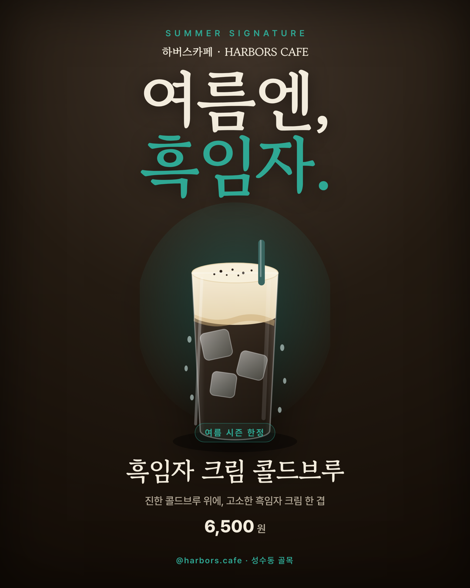

# 📜 Q3. [Design] 카페 신메뉴 포스터 만들기 — 25pt

> 🎯 SNS 피드에서 손가락을 멈추게 만드는 신메뉴 포스터 한 장

## 결과물


`포스터_흑임자콜드브루_1080x1350.png` · **1080×1350** (인스타 4:5) · `sips` 실측 통과

---

## 1. 왜 이 신메뉴인가 — Q2와 같은 브랜드로 이어감

이 포스터는 **Q2 하버스카페 메뉴판과 같은 카페의 여름 신메뉴**다. 즉석에서 만든 게 아니라
`my_cafe.md`의 두 자산을 **곱한** 결과다.

| 신메뉴 설계 근거 | 출처 |
|---|---|
| 시그니처 = **흑임자** (라떼) | `my_cafe.md` 시그니처 메뉴 |
| 기존 메뉴 **콜드브루** 5,000 | `my_cafe.md` 가격대 |
| → **흑임자 크림 콜드브루** (여름 아이스 변주) | 위 둘의 결합 = 브랜드 안에서 자연스러운 신메뉴 |
| 여름 시즌 한정 (사야 하는 이유) | 오늘 2026-07-19 = 여름 · `my_cafe.md`의 "디저트 당일 생산" 같은 시즌 운영 결 |

> 팁의 예시 *"맛있는 신메뉴 출시!"보다 **"여름엔, 자몽."**처럼 짧고 강하게* 를 그대로 적용해
> 메인 카피를 **"여름엔, 흑임자."** (2단어)로 잡았다.

## 2. 미션 요구 충족 체크

| 파트 | 요구 | 충족 |
|---|---|---|
| Part 1 — 이름 | 메뉴 이름 | ✅ 흑임자 크림 콜드브루 |
| Part 1 — 가격 | 가격 | ✅ 6,500원 (콜드브루 5,000 + 흑임자 크림) |
| Part 1 — 한 줄 설명 | 설명 | ✅ "진한 콜드브루 위에, 고소한 흑임자 크림 한 겹" |
| Part 1 — 사야 하는 이유 | 시즌 한정 등 1가지 | ✅ **여름 시즌 한정** (필 배지로 강조) |
| Part 2 — 메인 카피 | **3~7단어** 5초 후킹 | ✅ **"여름엔, 흑임자."** (짧고 강하게) |
| Part 2 — 보조 정보 1줄 | 가격·기간 | ✅ 시즌 한정 · 6,500원 |
| Part 3 — 사이즈 | **1080×1350** or A4 | ✅ 1080×1350 |
| Part 3 — 비주얼 **50%+** | 신메뉴가 절반 이상 | ✅ 중앙 히어로 잔 + 후광이 화면 세로 절반 이상 차지 |
| Part 3 — 빅 타이포 + 강조색 | 카피 부각 | ✅ 150px 세리프 헤드라인 + **흑임자**에만 틸 강조 |
| Part 4 — 게시 | 인스타/단톡방 | ⏳ PNG 준비 완료 (게시는 사용자 계정) |

## 3. 디자인 판단

- **톤**: Q2 메뉴판과 **같은 브랜드**지만, 포스터는 **다크로 반전**했다. 흑임자는 색이 어둡고 고소한 재료라
  다크 배경 위에서 크림층·얼음이 빛나며 시선을 끈다. 밝은 메뉴판 ↔ 어두운 포스터로 용도를 구분.
- **강조색 1개**: 하버 틸(`#2FA894`)만 포인트로. 헤드라인의 "흑임자", 시즌 배지, 푸터에만 사용.
- **폰트 2개**: Gowun Batang(헤드라인·메뉴명) + Pretendard(설명·가격).
- **비주얼 우선**: 잔 일러스트에 크림층·흑임자 알갱이·얼음·물방울·빨대·후광을 넣어 "차갑고 고소한" 한 잔을 한눈에.

## 4. 비주얼 — 수작업 SVG (Q2와 동일 사유)

생성형 이미지 무료 티어가 **2026-07-19 유료화(402)** 되어, 히어로 드링크를 **직접 SVG로 그렸다**
(`생성이미지/drink_흑임자콜드브루.svg`). 콜드브루(다크)·흑임자 크림층·경계 물결·얼음 3개·물방울·빨대·틸 후광을
벡터로 조립. 사진 대신 일러스트라는 점을 감추지 않는다.

## 5. 제작·렌더 방식

- **조판**: HTML/CSS (`poster.html`) — 절대배치 레이어(브랜드/카피/히어로/메뉴/푸터)
- **비주얼**: 수작업 SVG
- **렌더**: 헤드리스 Chrome 2x(2160×2700) → 1080×1350 다운스케일
- **폰트**: Gowun Batang + Pretendard

> 🔧 **수정 기록**: 1차 렌더에서 "여름 시즌 한정" 배지가 잔 몸통 한가운데를 덮어 산만했다. 히어로 잔의
> `height`를 780→610으로 줄이고 아래로 내려, 배지가 잔 **하단 라벨처럼** 걸리도록 재배치했다.

## 6. 규격 검증

| 체크 | 결과 |
|---|---|
| 1080×1350 | ✅ `sips` 실측 |
| 신메뉴 비주얼 50%+ | ✅ 중앙 히어로가 세로 절반 이상 |
| 메인 카피 3~7단어 | ✅ 2단어 "여름엔, 흑임자." |
| 강조색 1개 | ✅ 하버 틸만 |
| 모바일 축소 가독성 | ✅ `검증/포스터_350.png` (350px에서 카피·메뉴명 판독) |

## 7. 파일 구조
```
[Q3] 카페 신메뉴 포스터 만들기/
├── README.md
├── poster.html                            ← 조판 템플릿
├── 포스터_흑임자콜드브루_1080x1350.png        ← 최종 제출물
├── 생성이미지/drink_흑임자콜드브루.svg         ← 수작업 히어로 일러스트
└── 검증/포스터_350.png                       ← 축소 가독성 검증
```
