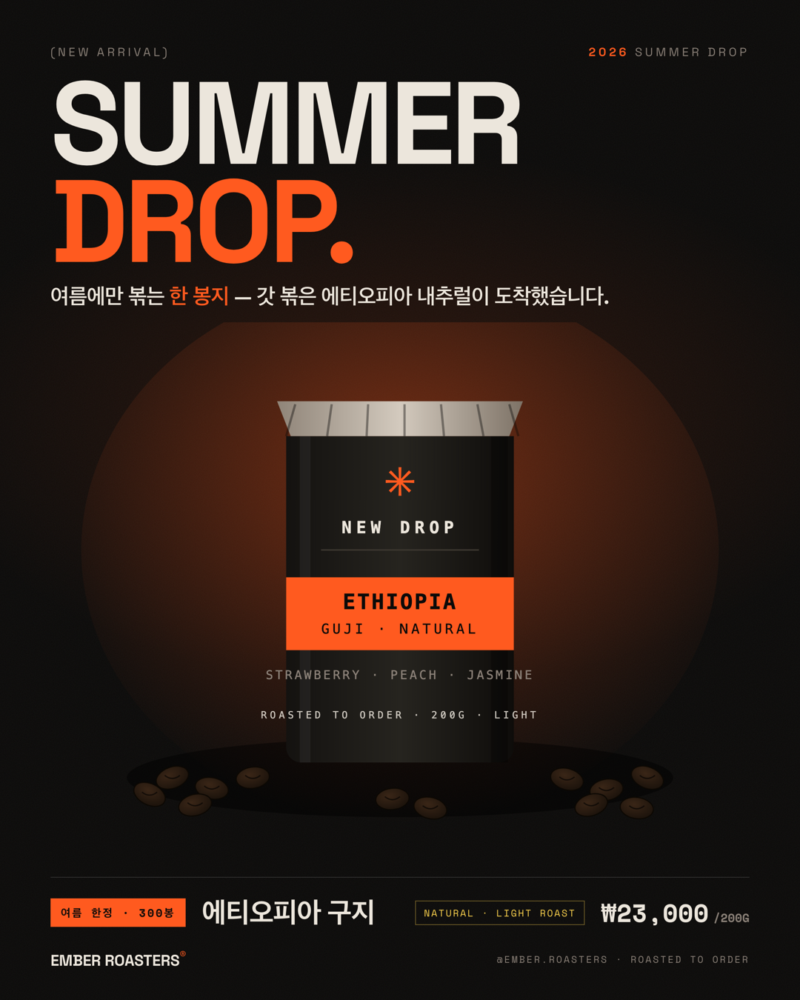

# 📜 Q3. [Design] 카페 신메뉴 포스터 만들기 — 25pt

> 🎯 SNS 피드에서 손가락을 멈추게 만드는 신메뉴 포스터 한 장

## 결과물


`포스터_EmberSummerDrop_1080x1350.png` · **1080×1350** (인스타 4:5) · `sips` 실측 통과

---

## 1. 왜 이 신메뉴인가 — Q2와 같은 브랜드(Ember Roasters)

이 포스터는 **Q2 Ember Roasters 원두 메뉴판과 같은 브랜드의 여름 신규 드롭**이다.
6주차에 직접 만든 커피 쇼핑몰 앱의 디자인 시스템을 그대로 계승했다.

| 신메뉴 설계 | 근거 |
|---|---|
| 브랜드 = **Ember Roasters®** (주문 후 볶는 로스터리) | `ai_6week_study` 커피 쇼핑몰 앱 |
| 신메뉴 = **에티오피아 구지 내추럴** (여름 싱글오리진 드롭) | 앱 카테고리 `싱글오리진` + 여름 한정 |
| 헤드라인 "SUMMER DROP." | 앱 히어로 `ROASTED TO ORDER.` 구조(2단·강조어 ember)를 그대로 변주 |
| 컵노트 Strawberry·Peach·Jasmine / Light Roast | 에티오피아 내추럴의 통상 컵노트 (여름 청량감) |

## 2. 미션 요구 충족 체크

| 파트 | 요구 | 충족 |
|---|---|---|
| Part 1 — 이름·가격·설명 | | ✅ 에티오피아 구지 · ₩23,000/200G · "갓 볶은 에티오피아 내추럴" |
| Part 1 — 사야 하는 이유 | 시즌 한정 등 | ✅ **여름 시즌 한정 · 300봉** |
| Part 2 — 메인 카피 3~7단어 | | ✅ **"SUMMER DROP."** (2단어) + 한글 서브카피 |
| Part 2 — 보조 정보 1줄 | | ✅ 여름 한정 · 300봉 · ₩23,000 |
| Part 3 — 사이즈 | 1080×1350 | ✅ |
| Part 3 — 빅 타이포 + 강조색 | | ✅ **158px 대형 타이포** + ember 강조 (DROP.) |
| Part 3 — 비주얼 50%+ | 신메뉴 이미지 절반 이상 | ✅ 중앙 대형 히어로(원두백+원두 더미+스팟라이트)가 세로 **절반 이상** |
| Part 4 — 게시 | 인스타/단톡방 | ⏳ PNG 준비 완료 (게시는 사용자) |

## 3. 타이포 + 비주얼 50%, 둘 다 잡은 구성

1차 시안은 "타이포 중심"이라 제품 비주얼이 작아 Part 3의 *"비주얼 50% 이상"* 을 문자 그대로는
충족하지 못했다. **"퀘스트 기준을 지키면서 타이포를 쓰라"** 는 피드백에 따라 재구성했다.

- **상단**: 대형 타이포 "SUMMER DROP." (타이포 유지)
- **중앙(50%+)**: 큰 원두백 + 바닥에 흩뿌린 원두 + 앰버 스팟라이트 = **신메뉴 비주얼이 화면 절반 이상**
- **하단**: 정보 바(시즌·이름·로스트·가격) + 브랜드 푸터

→ 배경 여백을 비우지 않고 타이포·비주얼·정보가 위→아래로 꽉 차게 균형을 잡았다.

## 4. 디자인 판단

- **톤**: Q2 메뉴판과 동일한 Ember 시스템 — 웜블랙 `#0b0a09` + 앰버 `#ff5a1f` + 크림 `#ece6dc` + 그레인.
- **폰트 2개**: Space Grotesk(타이포) + Space Mono(라벨·가격). 한글은 시스템 폴백.
- **강조색 1개**: ember만. "DROP.", 한글 "한 봉지", 시즌 배지, 넘버.
- **여백**: 중앙을 비워 초대형 타이포에 무게를 몰아줬다.

## 5. 비주얼 — 수작업 SVG

여름 원두백을 직접 SVG로 그렸다(`생성이미지/ember_썸머백.svg`) — NEW DROP / ETHIOPIA GUJI · NATURAL /
컵노트 / ROASTED TO ORDER. (생성형 이미지 유료화 402 대응, Q2와 동일)

## 6. 규격 검증

| 체크 | 결과 |
|---|---|
| 1080×1350 | ✅ `sips` 실측 |
| 메인 카피 3~7단어 | ✅ 2단어 |
| 빅 타이포 + 강조색 | ✅ 248px + ember |
| 비주얼 50%+ | ✅ 중앙 대형 히어로가 세로 절반 이상 |
| 모바일 축소 가독성 | ✅ `검증/포스터_350.png` |

## 7. 파일 구조
```
[Q3] 카페 신메뉴 포스터 만들기/
├── README.md
├── poster.html                              ← Ember 디자인 타이포 포스터
├── 포스터_EmberSummerDrop_1080x1350.png       ← 최종 제출물
├── 생성이미지/ember_썸머백.svg                 ← 수작업 원두백 비주얼
└── 검증/포스터_350.png                        ← 축소 가독성 검증
```
