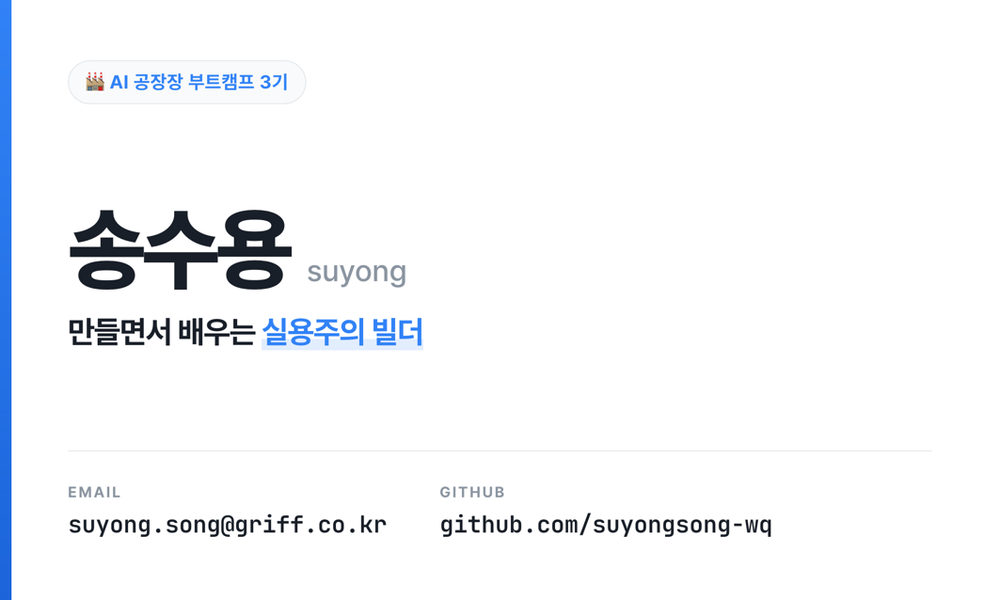
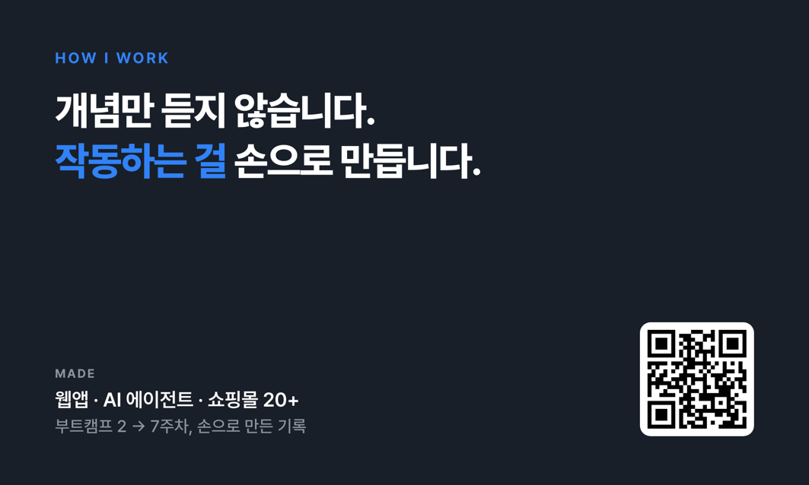

# 📜 Q4. [Design] 내 명함 만들기 — 25pt

> 🎯 처음 만난 사람이 5초 만에 "이 사람 뭐 하는 사람이지?"를 알 수 있는 명함

## 결과물
| 앞면 | 뒷면 |
|---|---|
|  |  |

`명함_앞면_1063x638.png` · `명함_뒷면_1063x638.png` · **90×54mm 표준 명함 @300dpi = 1063×638px**

---

## 1. 나를 한 단어로 정의하면

> **"만들면서 배우는 실용주의 빌더"**

지어낸 문구가 아니다. **3주차에 직접 쓴 `about-me.md`** 에서 그대로 가져왔고, G3 프로필카드와 정체성을 통일했다.

| 명함에 쓴 것 | 출처 |
|---|---|
| 송수용 / suyong | `about-me.md` §1 `이름: 송수용 (영문/닉네임: suyong)` |
| "만들면서 배우는 실용주의 빌더" | §1 `실용주의 학습자` + `작동하는 결과물을 직접 손으로 만들면서 배운다` |
| "개념만 듣지 않습니다. 작동하는 걸 손으로 만듭니다." (뒷면) | §1 `배우는 방식` 문장을 카피화 |
| suyong.song@griff.co.kr | §1 `연락 방법` |
| github.com/suyongsong-wq | G3 프로필카드에서 검증한 실제 핸들 |
| 웹앱·AI 에이전트·쇼핑몰 20+ | 실제 리포지토리 폴더 (2~7주차) |

## 2. 미션 요구 충족 체크

| 파트 | 요구 | 충족 |
|---|---|---|
| Part 1 — 한 단어 정의 | 직함/태그라인 한 줄 | ✅ "만들면서 배우는 실용주의 빌더" |
| Part 1 — 포인트 1개 | 가장 보여주고 싶은 것 | ✅ "작동하는 걸 손으로 만든다" (앞: 밑줄 강조 / 뒤: 헤드라인) |
| Part 2 — 핵심 정보 | 이름·직함·연락처(링크 1~2) | ✅ 이름·직함·email·github = **4개 (5 이내)** |
| Part 3 — 사이즈 | **90×54mm 표준** | ✅ 1063×638px (@300dpi) |
| Part 3 — 앞면+뒷면 | 뒷면 QR/슬로건/포트폴리오 | ✅ 뒷면 = 슬로건 + GitHub **QR** + 실적 |
| Part 3 — 강조 딱 1개 | 크기·색으로 1개만 | ✅ 앞면 "실용주의 빌더"에만 블루 하이라이트 |
| Part 4 — 출력/공유 | PDF·단톡방 공유 | ⏳ 앞/뒤 PNG 준비 완료 (공유는 사용자) |

## 3. 디자인 판단

- **컬러**: G3 프로필카드와 통일한 **Toss Blue `#3182F6`** + Grey900/500 (메인 1 + 보조 2, 3색 이내).
  `about-me.md` §3의 "디자인은 토스(Toss) 스타일 참고"에서 도출.
- **폰트 2개**: Pretendard(이름·직함) + JetBrains Mono(email·github). 연락처를 모노로 쓴 이유는
  이메일·URL은 **한 글자만 틀려도 안 되는 정보**라 자간 고른 서체가 오독을 막기 때문. (G3와 동일 원칙)
- **강조 1개**: 팁의 *"강조는 딱 1개에만"* 을 지켜, 앞면은 "실용주의 빌더" 한 구절에만 블루.
- **앞↔뒤 톤 반전**: 앞(화이트) ↔ 뒤(네이비 다크). 뒤집었을 때 "다른 면"이 즉시 인지된다. (G3 원칙 계승)
- **여백**: 팁의 *"빈 공간이 곧 고급스러움"* 대로 앞면 우측을 의도적으로 비웠다.

## 4. 제작·렌더 방식

- **조판**: HTML/CSS (`card.html`) — `?side=front|back` 로 한 면씩 렌더
- **QR**: `api.qrserver.com` 실시간 생성 → `github.com/suyongsong-wq` 연결 (뒷면에서 스캔 가능 확인)
- **렌더**: 헤드리스 Chrome `--window-size=1063,638 --force-device-scale-factor=2` → 2x 캡처 후 1063×638로 다운스케일. QR 외부 로드 때문에 `--virtual-time-budget=6000` 으로 네트워크 대기.
- **폰트**: Pretendard(CDN) + JetBrains Mono(구글)

## 5. 규격 검증

| 체크 | 결과 |
|---|---|
| 90×54mm (1063×638 @300dpi) | ✅ 앞/뒤 `sips` 실측 |
| 핵심 정보 5가지 이내 | ✅ 4개 |
| 컬러 3색 이내 | ✅ 블루 1 + 그레이 2 |
| 폰트 2개 이내 | ✅ Pretendard + JetBrains Mono |
| 강조 1개만 | ✅ "실용주의 빌더" |
| QR / 링크 연결 | ✅ github.com/suyongsong-wq |
| **흑백 출력 판독** | ✅ `검증_흑백/` — 앞/뒤 전 항목 판독, QR 스캔 유지 |

## 6. 한 줄 컨셉 설명 (제출물)

> **"나를 한 단어로 정의하면 ___ 만들면서 배우는 실용주의 빌더."**
> 회사 직함이 아니라 **일하는 방식**을 명함의 정체성으로 삼았다 — 처음 만난 사람이 5초 안에
> "손으로 만들어 배우는 사람"임을 읽도록.

## 7. 파일 구조
```
[Q4] 내 명함 만들기/
├── README.md
├── card.html                     ← 조판 템플릿 (?side=front|back)
├── 명함_앞면_1063x638.png          ← 앞면 (소개)
├── 명함_뒷면_1063x638.png          ← 뒷면 (슬로건 + QR)
└── 검증_흑백/                     ← 흑백 출력 판독 검증
```
